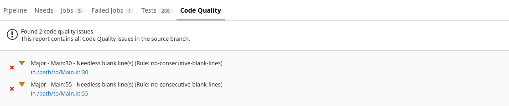

# GitLab compatible JSON reporter for ktlint
This is a custom reporter for [ktlint](https://github.com/pinterest/ktlint). 
It provides output in JSON format that can be parsed by GitLab automatically.

## Why? 
With the correct artifact format, the GitLab CI can show you what code style violations are present.
This helps you with inspecting Merge Requests before merging or keeping your code clean in general.

The reporter outputs the following format:
```json lines
[
   {
      "description": "<file name>:<line number> (Rule: <rule description>)",
      "severity": "major",
      "location": {
         "path": "<relative file path>",
         "lines": {
            "begin": "<line number>"
         }
      }
   }, 
   ...
]
```


## How do I use the reporter?
1. Download the `ktlint-gitlab-reporter.jar` from this repository.
2. Copy the JAR file to your Kotlin project.
3. To use the custom reporter, run `ktlint --reporter=gitlab,artifact=/path/to/ktlint-gitlab-reporter.jar`
   1. If you wish to specify the output directory run `ktlint --reporter=gitlab,artifact=/path/to/ktlint-gitlab-reporter.jar,output=path/to/output/output.json`

For more information about custom reporters, see the documentation [here](https://pinterest.github.io/ktlint/1.0.1/api/custom-reporter/) and the general ktlint documentation [here](https://pinterest.github.io/ktlint/)


## Other Download Options
Besides downloading the `ktlint-gitlab-reporter.jar` file directly you can head over to [Releases](https://github.com/Tobi2K/ktlint-gitlab-reporter/releases) or simply use the published package from Maven Central:
> *NOTE*: The `ktlint-gitlab-reporter-legacy.jar` uses ktlint version `0.46.1`. ktlint implemented some major changes in `0.49.0` and `ktlint-gitlab-reporter.jar` now supports ktlint `1.0.1`!
```
repositories {
    mavenCentral()
}

dependencies {
    implementation 'io.github.tobi2k:ktlint-gitlab-reporter:x.y.z'
}
```
> Note: AFAIK it is not possible to use the package as a reporter directly in ktlint, but you can automatically download the reporter using your preferred build tool (e.g., Gradle or Maven).

## Export artifacts in GitLab CI
This is a very small example on how to incorporate this custom reporter into GitLab CI. 
It is assumed, that you generally know how to use GitLab CI. Read up [here](https://docs.gitlab.com/ee/ci/).

> Hint: You should specify the output directory in the previous step for this.

> Warning: All violations will be marked as `major` for the overview.
 
Here `output=/build/reports/ktlint/ktlint.json` was used.
``` yaml
# gitlab-ci.yml
stages:
  - lint

ktlint:
  stage: lint
  image:
    name: openjdk:11-buster
    entrypoint: [""]
  allow_failure: true
  script:
    - ./gradlew --continue ktlint
  artifacts:
    reports:
      codequality: build/reports/ktlint/ktlint.json
```

This will generate a pipeline report. View it by going to your project and navigate to `CI/CD > Pipelines`, select your pipeline and go to the Code Quality tab.

> IMPORTANT NOTE: The `Code Quality` tab is only available with GitLab Premium or Ultimate. However, you can still download the created artifacts on the pipeline overview and view the JSON file.

Example: 


## Credits
This reporter was inspired by [https://github.com/kryanod/ktlint-junit-reporter](https://github.com/kryanod/ktlint-junit-reporter)

## License

MIT License

Copyright (c) 2022 Tobias Kalmbach

Permission is hereby granted, free of charge, to any person obtaining a copy of this software and associated documentation files (the "Software"), to deal in the Software without restriction, including without limitation the rights to use, copy, modify, merge, publish, distribute, sublicense, and/or sell copies of the Software, and to permit persons to whom the Software is furnished to do so, subject to the following conditions:

The above copyright notice and this permission notice shall be included in all copies or substantial portions of the Software.

THE SOFTWARE IS PROVIDED "AS IS", WITHOUT WARRANTY OF ANY KIND, EXPRESS OR IMPLIED, INCLUDING BUT NOT LIMITED TO THE WARRANTIES OF MERCHANTABILITY, FITNESS FOR A PARTICULAR PURPOSE AND NONINFRINGEMENT. IN NO EVENT SHALL THE AUTHORS OR COPYRIGHT HOLDERS BE LIABLE FOR ANY CLAIM, DAMAGES OR OTHER LIABILITY, WHETHER IN AN ACTION OF CONTRACT, TORT OR OTHERWISE, ARISING FROM, OUT OF OR IN CONNECTION WITH THE SOFTWARE OR THE USE OR OTHER DEALINGS IN THE SOFTWARE.

---

> GitHub [@Tobi2K](https://github.com/Tobi2K) &nbsp;&middot;&nbsp;
> Email [tobias@kalmbach.dev](mailto:tobias@kalmbach.dev)